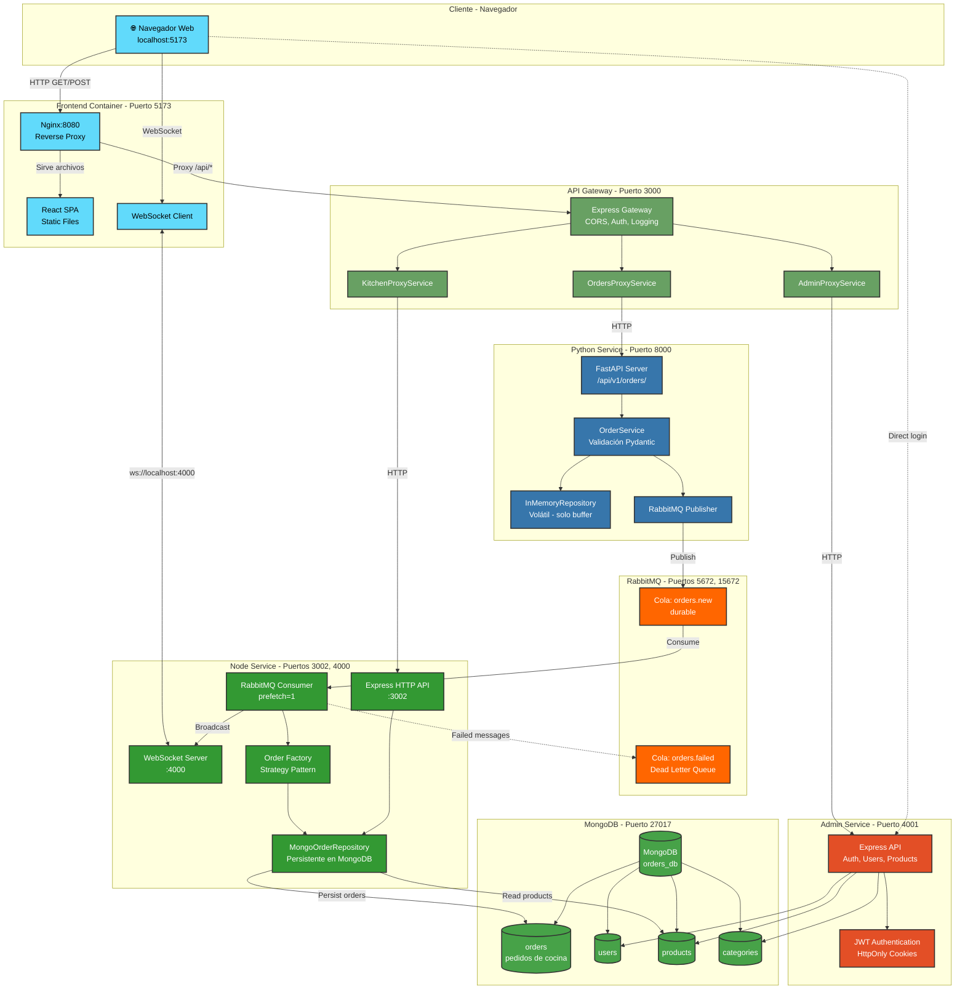
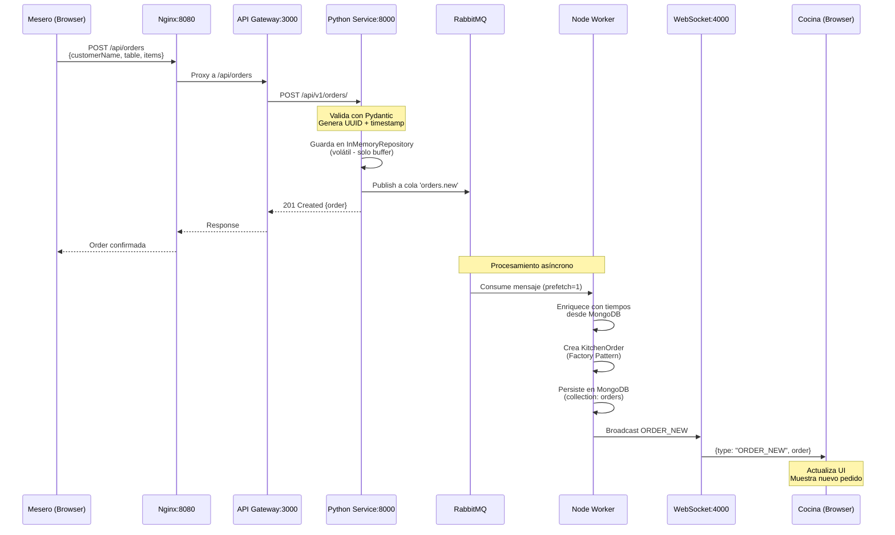
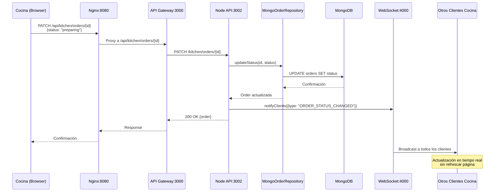
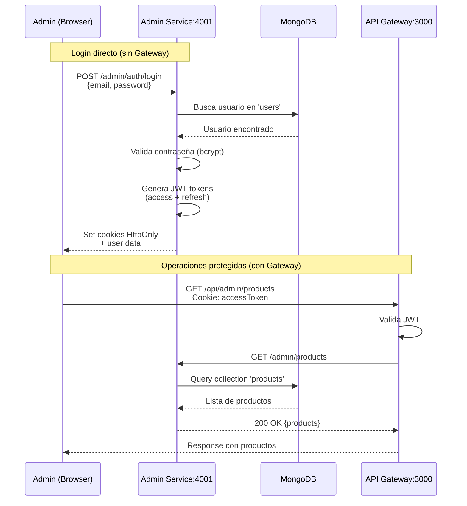
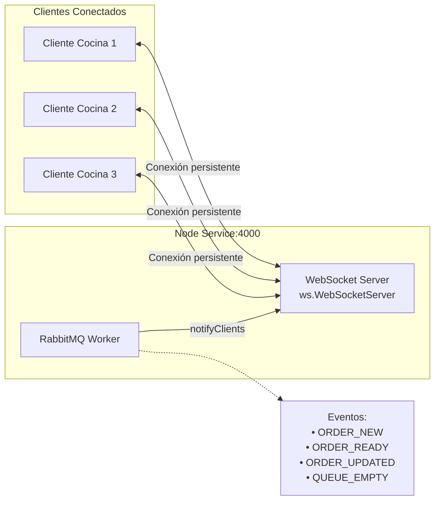

# Diagrama de Arquitectura - Sistema de Pedidos de Restaurante

## 📊 Arquitectura General del Sistema

Este documento describe la arquitectura distribuida de microservicios del sistema de gestión de pedidos de restaurante.

## 🎨 Diagrama de Componentes y Flujo de Datos



---

## 🔄 Flujo 1: Creación de Pedido (Mesero → Cocina)



---

## 🔄 Flujo 2: Actualización de Estado en Cocina



---

## 🔄 Flujo 3: Login y Gestión Administrativa



---

## 📡 Diagrama de Comunicación WebSocket



---

## 🗂️ Estructura de Datos - Orden

### OrderMessage (Python Service → RabbitMQ)
```json
{
  "id": "uuid-v4",
  "customerName": "Juan Pérez",
  "table": "Mesa 5",
  "items": [
    {
      "productName": "Hamburguesa",
      "quantity": 2,
      "unitPrice": 10500,
      "note": "Sin cebolla"
    }
  ],
  "createdAt": "2024-01-02T20:30:00.000Z",
  "status": "pendiente"
}
```

### KitchenOrder (Node Service - In Memory)
```json
{
  "id": "uuid-v4",
  "customerName": "Juan Pérez",
  "table": "Mesa 5",
  "items": [
    {
      "productName": "Hamburguesa",
      "quantity": 2,
      "unitPrice": 10500,
      "note": "Sin cebolla",
      "preparationTimeSeconds": 300
    }
  ],
  "createdAt": "2024-01-02T20:30:00.000Z",
  "status": "pending" | "preparing" | "ready" | "completed" | "cancelled"
}
```

---

## 🏗️ Patrones de Diseño Implementados

### 1. **Proxy Pattern** (API Gateway)
```typescript
// api-gateway/src/services/OrdersProxyService.ts
export class OrdersProxyService extends ProxyService {
  constructor() {
    super(SERVICES.PYTHON_MS, env.PYTHON_MS_URL);
  }
}
```
**Propósito**: Punto de entrada único que abstrae la comunicación con microservicios.

### 2. **Chain of Responsibility** (Error Handling)
```typescript
// api-gateway/src/handlers/
const errorHandlers: IErrorHandler[] = [
  new MicroserviceErrorHandler(),
  new ConnectionRefusedErrorHandler(),
  new TimeoutErrorHandler(),
  new UnknownErrorHandler(),
];
```
**Propósito**: Manejo modular y extensible de diferentes tipos de errores.

### 3. **Factory Pattern** (Order Creation)
```typescript
// orders-producer-node/src/application/factories/order.factory.ts
export function createKitchenOrderFromMessage(msg: OrderMessage): KitchenOrder {
  return {
    id: msg.id || uuidv4(),
    customerName: msg.customerName,
    table: msg.table,
    items: msg.items,
    createdAt: msg.createdAt || new Date().toISOString(),
    status: "pending"
  };
}
```
**Propósito**: Encapsula la lógica de creación de objetos complejos.

### 4. **Strategy Pattern** (Preparation Time Calculation)
```typescript
// orders-producer-node/src/domain/strategies/
interface PreparationStrategy {
  calculate(items: OrderItem[]): number;
}

class ExactNameStrategy implements PreparationStrategy { }
class FixedTimeStrategy implements PreparationStrategy { }
```
**Propósito**: Diferentes algoritmos de cálculo de tiempo intercambiables.

### 5. **Repository Pattern** (Data Access)

#### **Python Service - InMemoryOrderRepository**
```python
# orders-producer-python/app/repositories/order_repository.py
class InMemoryOrderRepository(OrderRepository):
    def __init__(self):
        self._orders = {}  # Diccionario en memoria
    
    def add(self, order: OrderMessage) -> None:
        self._orders[order.id] = order
    
    def get(self, order_id: str) -> Optional[OrderMessage]:
        return self._orders.get(order_id)
```

**Características:**
- ✅ **Volátil**: Los datos se pierden al reiniciar el servicio
- ✅ **Buffer temporal**: Solo para responder GET `/api/v1/orders/{id}` inmediatamente después de crear
- ✅ **No crítico**: RabbitMQ es la fuente de verdad, no este repositorio
- ✅ **Stateless**: El Python Service no mantiene estado de negocio

**Justificación**: El Python Service solo necesita validar y publicar. No requiere persistencia porque:
1. Los pedidos se publican inmediatamente a RabbitMQ
2. El Node Service se encarga del estado de cocina
3. Responde consultas GET solo para confirmación inmediata

#### **Node Service - MongoOrderRepository**
```typescript
// orders-producer-node/src/infrastructure/database/repositories/mongo.order.repository.ts
export class MongoOrderRepository implements OrderRepository {
  private collectionName = "orders";

  async create(order: KitchenOrder): Promise<void> {
    const col = await this.collection();
    await col.insertOne(order);  // ← Persiste en MongoDB
  }

  async updateStatus(id: string, status: KitchenOrder["status"]): Promise<boolean> {
    const col = await this.collection();
    const res = await col.updateOne({ id }, { $set: { status } });
    return res.matchedCount > 0;
  }
}
```

**Características:**
- ✅ **Persistente**: Los datos sobreviven a reinicios del servicio
- ✅ **Collection**: `orders_db.orders`
- ✅ **Estado de negocio**: Mantiene el estado actual de pedidos de cocina
- ✅ **Crítico**: Evita pérdida de pedidos activos

**Justificación**: El Node Service necesita persistencia porque:
1. Los pedidos de cocina tienen ciclo de vida largo (pending → preparing → ready)
2. Un reinicio del servicio no debe perder pedidos activos
3. Permite trazabilidad y consultas históricas
4. La cocina depende de este estado para su operación

**Propósito General**: Abstrae la lógica de persistencia permitiendo diferentes implementaciones según necesidades del servicio.

---

#### 📊 Comparación de Repositorios

| Aspecto | Python - InMemory | Node - MongoDB |
|---------|------------------|----------------|
| **Persistencia** | ❌ Volátil | ✅ Persistente |
| **Propósito** | Buffer temporal | Estado de negocio |
| **Crítico** | ❌ No | ✅ Sí |
| **Collection** | N/A | `orders` |
| **Sobrevive reinicio** | ❌ No | ✅ Sí |
| **Justificación** | Solo validar/publicar | Mantener estado de cocina |

---

## 🔐 Seguridad Implementada

### 1. **Autenticación JWT**
- Tokens en cookies HttpOnly (previene XSS)
- Access token + Refresh token
- Validación en API Gateway para rutas `/api/admin/*`

### 2. **CORS Configurado**
```typescript
cors({
  origin: 'http://localhost:5173',
  credentials: true
})
```

### 3. **Sanitización NoSQL**
```typescript
app.use(mongoSanitize({
  replaceWith: '_',
  onSanitize: ({ req, key }) => {
    console.warn(`⚠️ Sanitized malicious key: ${key}`);
  }
}));
```
**Previene**: Inyección NoSQL mediante operadores MongoDB (`$where`, `$gt`, etc.)

### 4. **Validación de Entrada**
- **Python**: Pydantic models
- **Node/Gateway**: Zod schemas
- **Propósito**: Prevenir datos malformados o maliciosos

---

## 📊 Puertos y Endpoints

| Servicio | Puerto | Protocolo | Endpoints Principales |
|----------|--------|-----------|----------------------|
| **Frontend** | 5173 | HTTP | UI de Mesero y Cocina |
| **API Gateway** | 3000 | HTTP | `/api/orders`, `/api/kitchen`, `/api/admin` |
| **Python Service** | 8000 | HTTP | `/api/v1/orders/` |
| **Node API** | 3002 | HTTP | `/kitchen/orders` |
| **Node WebSocket** | 4000 | WebSocket | Eventos en tiempo real |
| **Admin Service** | 4001 | HTTP | `/admin/auth`, `/admin/users`, `/admin/products` |
| **RabbitMQ** | 5672 | AMQP | Cola: `orders.new` |
| **RabbitMQ Mgmt** | 15672 | HTTP | Panel de administración |
| **MongoDB** | 27017 | MongoDB | Base de datos: `orders_db` |

---

## 🚀 Comandos de Ejecución

### Iniciar todos los servicios
```bash
docker compose up -d --build
```

### Ver logs de un servicio específico
```bash
docker logs front -f
docker logs api-gateway -f
docker logs python-ms -f
docker logs node-ms -f
docker logs admin-service -f
```

### Verificar estado de servicios
```bash
docker compose ps
```

### Reiniciar un servicio específico
```bash
docker compose restart front
```

### Detener todos los servicios
```bash
docker compose down
```

---

## 🔍 Verificación de Funcionamiento

### 1. Frontend
```bash
curl http://localhost:5173
```

### 2. API Gateway
```bash
curl http://localhost:3000/api/health
```

### 3. Python Service
```bash
curl http://localhost:8000/docs  # Swagger UI
```

### 4. Node Service
```bash
curl http://localhost:3002/kitchen/orders
```

### 5. Admin Service
```bash
curl http://localhost:4001/health
```

### 6. RabbitMQ Management
Abrir en navegador: http://localhost:15672
- Usuario: `guest`
- Contraseña: `guest`

### 7. WebSocket Connection Test
```javascript
const ws = new WebSocket('ws://localhost:4000');
ws.onmessage = (event) => console.log(JSON.parse(event.data));
```

---

## 📚 Referencias

- **AGENTS.md**: Guía para agentes de código (comandos, estilos, convenciones)
- **QA_REQUERIMIENTOS.md**: Requisitos de calidad y casos de test
- **SECURITY_AUDIT_AND_IMPROVEMENT_PLAN.md**: Guías de seguridad
- **README.md**: Visión general del sistema y configuración
- READMEs específicos en cada subdirectorio de servicio

---

## 🐛 Troubleshooting Común

### Problema: Frontend no carga (ERR_SOCKET_NOT_CONNECTED)
**Causa**: Puerto interno de Nginx (8080) no coincide con mapeo en docker-compose (5173:5173)  
**Solución**: Cambiar a `5173:8080` en docker-compose.yml

### Problema: CORS errors
**Causa**: CORS_ORIGIN no configurado correctamente  
**Solución**: Verificar que todos los servicios tengan `CORS_ORIGIN=http://localhost:5173`

### Problema: WebSocket no conecta
**Causa**: URL incorrecta o puerto no expuesto  
**Solución**: Verificar `VITE_NODE_MS_URL=http://localhost:4000` y mapeo `4000:4000`

### Problema: Pedidos no aparecen en cocina
**Causa**: Worker de RabbitMQ no está consumiendo  
**Solución**: Verificar logs de node-ms y conexión a RabbitMQ

### Problema: Autenticación falla
**Causa**: JWT_SECRET diferente entre servicios  
**Solución**: Asegurar mismo `JWT_SECRET` en api-gateway y admin-service

### Problema: Pedidos se pierden al reiniciar Node Service
**Causa**: Esto NO debería pasar - el sistema usa MongoDB para persistencia  
**Solución**: Verificar que `USE_MONGO=true` y `MONGO_URI` estén configurados correctamente

---

## 📜 Evolución del Sistema - Migración de Persistencia

### Historia de la Arquitectura

**Versión Inicial (Documentada)**:
- Python Service: InMemoryRepository ✅
- Node Service: InMemoryRepository ❌ (documentado pero nunca implementado así)

**Versión Actual (Implementada)**:
- Python Service: InMemoryRepository ✅ (sin cambios)
- Node Service: MongoOrderRepository ✅ (migrado a MongoDB)

### Razón de la Migración

Según `USER_HISTORY.md`:
> "Migrar la persistencia de pedidos desde memoria a MongoDB para garantizar persistencia, escalabilidad y trazabilidad."

**Beneficios logrados:**
1. ✅ **Persistencia**: Pedidos no se pierden en reinicios
2. ✅ **Escalabilidad**: Múltiples instancias pueden compartir estado
3. ✅ **Trazabilidad**: Histórico completo de pedidos
4. ✅ **Confiabilidad**: Estado de cocina siempre disponible

**Trade-offs aceptados:**
- Mayor complejidad de infraestructura (requiere MongoDB)
- Latencia ligeramente mayor (I/O de disco vs memoria)
- Dependencia adicional en el stack

### Actualización de Documentación (2 enero 2026)

Esta documentación ha sido actualizada para reflejar la implementación real del sistema:
- ✅ `.github/copilot-instructions.md` - Corregido
- ✅ `AGENTS.md` - Corregido
- ✅ `ARCHITECTURE_DIAGRAM.md` - Corregido con detalles completos

---

**Última actualización**: 2 de enero de 2026  
**Versión del sistema**: 1.0.0  
**Documentación sincronizada con implementación**: ✅
