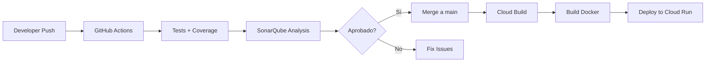

# 🔄 CI/CD Configuration

Este proyecto soporta dos plataformas de CI/CD:

## 1. GitHub Actions (Principal) ✅

**Archivo**: `.github/workflows/build.yml`

**Uso**: 
- Análisis de código con SonarQube
- Tests y coverage automático
- Ejecutado en cada push y pull request

**Configuración requerida**:

En **Settings → Secrets and variables → Actions**, agregar:

```yaml
SONAR_TOKEN: "tu-token-de-sonarqube"
SONAR_HOST_URL: "https://tu-instancia-sonarqube.com"
```

**Triggers**:
- Push a: `main`, `develop`, `feature/**`, `hotfix/**`
- Pull requests

**Funcionalidades**:
- ✅ Ejecuta tests de todos los servicios
- ✅ Genera reportes de coverage (LCOV + Cobertura XML)
- ✅ Análisis de SonarQube con coverage
- ✅ Sube artifacts de coverage

---

## 2. Google Cloud Build (Alternativo)

**Archivo**: `cloudbuild.yaml`

**Uso**:
- Build y deploy de imágenes Docker
- Despliegue a Cloud Run
- Tests y SonarQube (configurado pero opcional)

**Configuración requerida**:

En Cloud Build triggers, agregar substitutions:

```yaml
_AR_HOSTNAME: "us-central1-docker.pkg.dev"
_AR_PROJECT_ID: "tu-proyecto"
_AR_REPOSITORY: "tu-repositorio"
_DEPLOY_REGION: "us-central1"
_PLATFORM: "managed"
_SONAR_PROJECT_KEY: "sistema-pedidos-restaurante"
_SONAR_HOST_URL: "https://tu-sonarqube.com"
_SONAR_TOKEN: "tu-token"
```

**Funcionalidades**:
- ✅ Build de imágenes Docker para todos los servicios
- ✅ Push a Artifact Registry
- ✅ Deploy a Cloud Run
- ✅ Tests y coverage (opcional)
- ✅ Análisis SonarQube (opcional)

---

## 📋 Recomendaciones

### Para desarrollo diario:
Usar **GitHub Actions** (`.github/workflows/build.yml`)
- Más rápido para feedback en PRs
- Integrado con GitHub
- Ideal para análisis de código

### Para despliegue a producción:
Usar **Google Cloud Build** (`cloudbuild.yaml`)
- Optimizado para Google Cloud
- Deploy directo a Cloud Run
- Control de imágenes en Artifact Registry

---

## 🚀 Flujo Recomendado



---

## 📝 Archivos de Configuración

| Archivo | Propósito | Plataforma |
|---------|-----------|------------|
| `.github/workflows/build.yml` | CI: Tests, Coverage, SonarQube | GitHub Actions |
| `cloudbuild.yaml` | CD: Build, Deploy | Google Cloud Build |
| `sonar-project.properties` | Config de SonarQube | Ambos |
| `docker-compose.yml` | Desarrollo local | Local |

---

## 🔧 Troubleshooting

### GitHub Actions no ejecuta tests
- Verificar que los secrets `SONAR_TOKEN` y `SONAR_HOST_URL` estén configurados
- Revisar logs en Actions tab del repositorio

### Cloud Build falla en deploy
- Verificar substitutions configuradas
- Verificar permisos en GCP
- Revisar logs en Cloud Build console

---

## 📚 Referencias

- [GitHub Actions Documentation](https://docs.github.com/en/actions)
- [Google Cloud Build Documentation](https://cloud.google.com/build/docs)
- [SonarQube Documentation](https://docs.sonarsource.com/)
