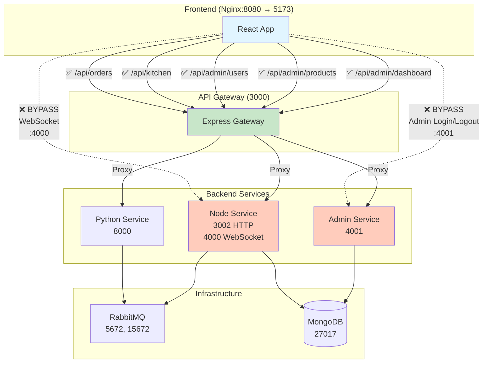
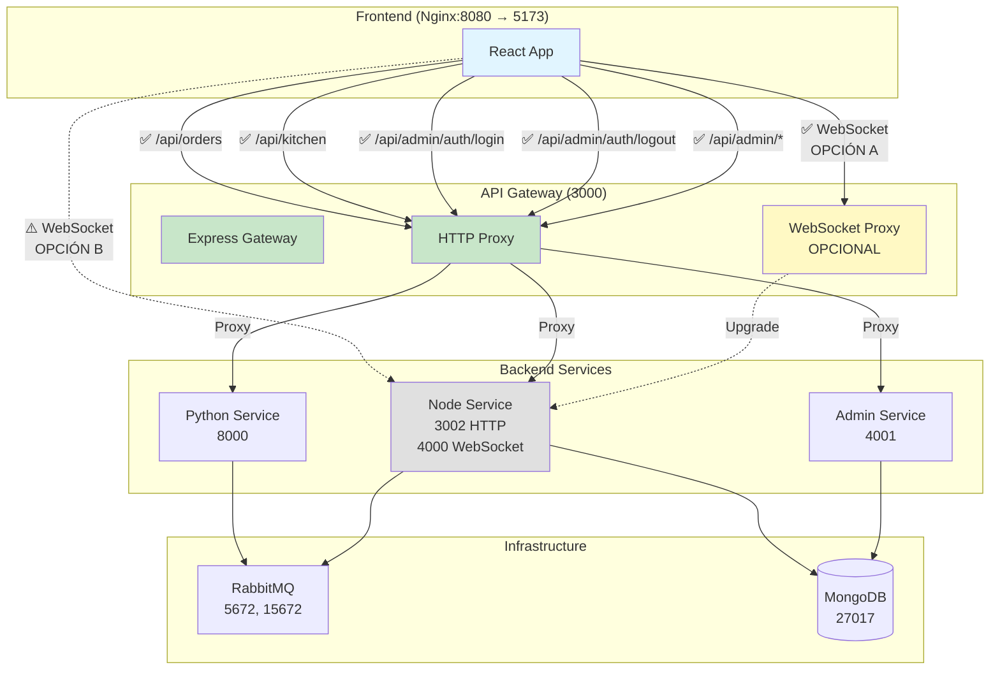

# Plan de Centralización del API Gateway

**Fecha**: 2026-01-02  
**Estado**: Análisis Inicial - Pendiente de Decisiones Técnicas  
**Objetivo**: Centralizar TODAS las comunicaciones del sistema a través del API Gateway

---

## 📋 Tabla de Contenidos

1. [Resumen Ejecutivo](#resumen-ejecutivo)
2. [Análisis de Estado Actual](#análisis-de-estado-actual)
3. [Problemas Identificados](#problemas-identificados)
4. [Arquitectura Propuesta](#arquitectura-propuesta)
5. [Decisiones Pendientes](#decisiones-pendientes)
6. [Plan de Implementación](#plan-de-implementación)
7. [Impacto y Riesgos](#impacto-y-riesgos)
8. [Referencias](#referencias)

---

## 🎯 Resumen Ejecutivo

### Problema
El sistema actual tiene comunicaciones fragmentadas donde algunos componentes del frontend bypasean el API Gateway y se conectan directamente a los microservicios backend:

- **Admin Login/Logout** → Directo a puerto 4001 (Admin Service)
- **WebSocket** → Directo a puerto 4000 (Node Service)

Esto rompe el principio de tener un único punto de entrada, generando:
- ❌ Múltiples puntos de exposición de servicios
- ❌ Dificultad para aplicar políticas de seguridad centralizadas
- ❌ Complejidad en logging/monitoring/auditoría
- ❌ Configuración inconsistente entre entornos

### Objetivo
Refactorizar la arquitectura para que **TODAS** las comunicaciones frontend → backend pasen exclusivamente por el API Gateway (puerto 3000), estableciendo un único punto de control.

---

## 📊 Análisis de Estado Actual

### Diagrama de Comunicación Actual



### Inventario de Endpoints

#### ✅ Comunicaciones que SÍ usan API Gateway

| Funcionalidad | Frontend URL | Gateway Route | Backend Service |
|---------------|--------------|---------------|-----------------|
| Crear pedido | `/api/orders` | `/api/orders` → | Python:8000 |
| Consultar pedido | `/api/orders/:id` | `/api/orders/:id` → | Python:8000 |
| Listar pedidos cocina | `/api/kitchen/orders` | `/api/kitchen/orders` → | Node:3002 |
| Actualizar estado pedido | `/api/kitchen/orders/:id` | `/api/kitchen/orders/:id` → | Node:3002 |
| Listar usuarios | `/api/admin/users` | `/api/admin/users` → | Admin:4001 |
| Crear usuario | `/api/admin/users` (POST) | `/api/admin/users` → | Admin:4001 |
| Gestionar productos | `/api/admin/products` | `/api/admin/products` → | Admin:4001 |
| Dashboard orders | `/api/admin/dashboard/orders` | `/api/admin/dashboard/orders` → | Admin:4001 |
| Dashboard metrics | `/api/admin/dashboard/metrics` | `/api/admin/dashboard/metrics` → | Admin:4001 |
| Password recovery | `/api/auth/forgot-password` | `/api/auth/forgot-password` → | Admin:4001 |
| Reset password | `/api/auth/reset-password` | `/api/auth/reset-password` → | Admin:4001 |

#### ❌ Comunicaciones que BYPASEAN API Gateway

| Funcionalidad | Frontend Config | Destino Directo | Archivo Fuente |
|---------------|-----------------|-----------------|----------------|
| **Admin Login** | `ADMIN_SERVICE_BASE` | `http://localhost:4001/admin/auth/login` | `orders-producer-frontend/src/config/adminApi.ts:5` |
| **Admin Logout** | `ADMIN_SERVICE_BASE` | `http://localhost:4001/admin/auth/logout` | `orders-producer-frontend/src/config/adminApi.ts:6` |
| **WebSocket Cocina** | `getWebSocketUrl()` | `ws://localhost:4000` | `orders-producer-frontend/src/hooks/useKitchenWebSocket.ts:13` |
| **WebSocket Dashboard** | `getWebSocketUrl()` | `ws://localhost:4000` | `orders-producer-frontend/src/hooks/useDashboardUpdates.ts:36` |
| **WebSocket Service** | `getWebSocketUrl()` | `ws://localhost:4000` | `orders-producer-frontend/src/services/websocketService.ts:11` |
| **WebSocket Kitchen Orders** | Hardcoded fallback | `ws://localhost:4000` | `orders-producer-frontend/src/hooks/useKitchenOrders.ts` |

### Configuración Actual

#### Docker Compose - Variables de Entorno
```yaml
# Frontend build args
front:
  args:
    - VITE_API_GATEWAY_URL=http://localhost:3000  # ✅ Correcto
    - VITE_NODE_MS_URL=http://localhost:4000       # ❌ Bypasea Gateway

# API Gateway environment
api-gateway:
  environment:
    - PYTHON_MS_URL=http://python-ms:8000
    - NODE_MS_URL=http://node-ms:3002
    - ADMIN_MS_URL=http://admin-service:4001
    - CORS_ORIGIN=http://localhost:5173
```

#### Frontend Configuration Files

**`orders-producer-frontend/src/config/api.ts`** (✅ CORRECTO)
```typescript
export const API_BASE_URL = import.meta.env.VITE_API_GATEWAY_URL || 'http://localhost:3000';

export const API_ENDPOINTS = {
  CREATE_ORDER: `${API_BASE_URL}/api/orders`,
  GET_ORDER: (id: string) => `${API_BASE_URL}/api/orders/${id}`,
  KITCHEN_ORDERS: `${API_BASE_URL}/api/kitchen/orders`,
  UPDATE_ORDER: (id: string) => `${API_BASE_URL}/api/kitchen/orders/${id}`,
};
```

**`orders-producer-frontend/src/config/adminApi.ts`** (❌ INCORRECTO)
```typescript
export const ADMIN_API_BASE = import.meta.env.VITE_API_GATEWAY_URL || 'http://localhost:3000';
export const ADMIN_SERVICE_BASE = 'http://localhost:4001'; // ❌ BYPASS directo

export const ADMIN_ENDPOINTS = {
  LOGIN: `${ADMIN_SERVICE_BASE}/admin/auth/login`,    // ❌ BYPASS
  LOGOUT: `${ADMIN_SERVICE_BASE}/admin/auth/logout`,  // ❌ BYPASS
  USERS: `${ADMIN_API_BASE}/api/admin/users`,         // ✅ Correcto
  PRODUCTS: `${ADMIN_API_BASE}/api/admin/products`,   // ✅ Correcto
  // ... otros endpoints correctos
};
```

**WebSocket Configuration** (❌ INCORRECTO)
```typescript
// En múltiples archivos:
export const getWebSocketUrl = (): string => {
  const nodeServiceUrl = import.meta.env.VITE_NODE_MS_URL;
  if (nodeServiceUrl) {
    return nodeServiceUrl.replace(/^https?/, nodeServiceUrl.startsWith('https') ? 'wss' : 'ws');
  }
  return 'ws://localhost:4000';  // ❌ BYPASS directo
};
```

#### Nginx Configuration

**`orders-producer-frontend/default.conf`** (✅ Parcialmente correcto)
```nginx
server {
  listen 8080;
  root /usr/share/nginx/html;
  index index.html;

  location / {
    try_files $uri $uri/ /index.html;
  }

  # Proxy API requests to api-gateway
  location /api/ {
    proxy_pass http://api-gateway:3000/api/;  # ✅ Correcto
    proxy_set_header Host $host;
    proxy_set_header X-Real-IP $remote_addr;
    proxy_set_header X-Forwarded-For $proxy_add_x_forwarded_for;
    proxy_set_header X-Forwarded-Proto $scheme;
  }
  
  # ❌ FALTA: No hay configuración para WebSocket upgrade
}
```

---

## 🔍 Problemas Identificados

### Problema 1: Login/Logout Bypasea Gateway (Severidad: ALTA)

**Descripción:**  
El frontend está hardcodeado para hacer login/logout directamente al Admin Service (puerto 4001), ignorando completamente el API Gateway.

**Evidencia:**
- Archivo: `orders-producer-frontend/src/config/adminApi.ts`
- Línea 2: `export const ADMIN_SERVICE_BASE = 'http://localhost:4001';`
- Líneas 5-6: Login y Logout usan `ADMIN_SERVICE_BASE`

**Paradoja Descubierta:**  
El API Gateway **YA TIENE** implementada la ruta `/api/admin/auth/login`:
- Archivo: `api-gateway/src/routes/admin.routes.ts:11`
- Controller: `AdminController.login` (línea 40)
- Proxy correcto hacia Admin Service

**Causa Raíz:**  
Configuración incorrecta en el frontend, no un problema de arquitectura del Gateway.

**Impacto:**
- 🔓 Cookies de autenticación van directo al puerto 4001
- 📊 No hay logging centralizado de intentos de login
- 🛡️ Bypass de middlewares de seguridad del Gateway
- 🔄 Configuración inconsistente (otros endpoints SÍ usan Gateway)

**Solución:**
1. Cambiar `ADMIN_ENDPOINTS.LOGIN` para usar `ADMIN_API_BASE` (Gateway)
2. Agregar ruta `/api/admin/auth/logout` al Gateway (actualmente no existe)
3. Actualizar `adminService.ts` para usar las nuevas URLs

**Esfuerzo estimado:** 2 horas (cambio pequeño)

---

### Problema 2: WebSocket Bypasea Gateway (Severidad: MEDIA-ALTA)

**Descripción:**  
Todas las conexiones WebSocket del frontend se conectan directamente al Node Service (puerto 4000), no al Gateway.

**Archivos afectados:**
1. `orders-producer-frontend/src/hooks/useKitchenWebSocket.ts:13`
2. `orders-producer-frontend/src/hooks/useDashboardUpdates.ts:36`
3. `orders-producer-frontend/src/hooks/useKitchenOrders.ts`
4. `orders-producer-frontend/src/services/websocketService.ts:11`

**Causa Raíz:**  
- Variable de entorno `VITE_NODE_MS_URL=http://localhost:4000` apunta directo al servicio
- API Gateway no tiene soporte para WebSocket upgrade (proxy WS)

**Impacto:**
- 🔓 Conexión directa bypasea seguridad del Gateway
- 📊 No hay logging/monitoring de eventos WebSocket
- 🌐 CORS manejado por Node Service, no centralizado
- 🔄 Configuración dual (HTTP por Gateway, WS directo)

**Complejidad:**
- WebSocket requiere HTTP Upgrade headers
- API Gateway (Express) necesitaría `http-proxy-middleware` o solución similar
- Alternativa: Nginx podría manejar upgrade (pero agrega complejidad)

**Trade-offs:**

| Opción | Pros | Contras |
|--------|------|---------|
| **WebSocket por Gateway** | ✅ Centralización completa<br/>✅ Logging unificado<br/>✅ Seguridad consistente | ❌ Latencia adicional<br/>❌ Gateway como SPOF<br/>❌ Requiere implementación proxy WS |
| **WebSocket directo (status quo)** | ✅ Menor latencia<br/>✅ No requiere cambios Gateway<br/>✅ Menos carga en Gateway | ❌ Bypass de seguridad<br/>❌ No centralizado<br/>❌ Configuración inconsistente |
| **Nginx maneja WS upgrade** | ✅ Nginx optimizado para proxy<br/>✅ Gateway no se toca | ❌ Nginx como nuevo SPOF<br/>❌ Complejidad en config<br/>❌ Debugging más difícil |

**Recomendación pendiente** - Ver sección [Decisiones Pendientes](#decisiones-pendientes)

**Esfuerzo estimado:**
- WebSocket por Gateway: 8-12 horas (implementación + testing)
- Mantener directo: 1 hora (documentar excepción)
- Nginx maneja upgrade: 4-6 horas

---

### Problema 3: Variables de Entorno Inconsistentes

**Descripción:**  
Docker Compose configura URLs contradictorias que promueven el bypass del Gateway.

**Evidencia:**
```yaml
# docker-compose.yml líneas 94-95
front:
  build:
    args:
      - VITE_API_GATEWAY_URL=http://localhost:3000  # ✅ Apunta a Gateway
      - VITE_NODE_MS_URL=http://localhost:4000       # ❌ Apunta directo a Node
```

**Problema:**
- `VITE_NODE_MS_URL` es usado por funciones `getWebSocketUrl()` en el frontend
- Promueve conexión directa al Node Service
- Inconsistente con principio de "todo por Gateway"

**Solución (depende de decisión sobre WebSockets):**

**Opción A - WebSocket por Gateway:**
```yaml
front:
  build:
    args:
      - VITE_API_GATEWAY_URL=http://localhost:3000
      - VITE_WEBSOCKET_URL=ws://localhost:3000  # Nuevo: WS por Gateway
```

**Opción B - WebSocket directo (documentado):**
```yaml
front:
  build:
    args:
      - VITE_API_GATEWAY_URL=http://localhost:3000
      - VITE_WEBSOCKET_URL=ws://localhost:4000  # Renombrado para claridad
      # Nota: WebSocket directo por rendimiento (ver docs/ADR-001)
```

---

### Problema 4: Falta Ruta de Logout en Gateway

**Descripción:**  
El API Gateway tiene ruta de login pero NO tiene ruta de logout.

**Evidencia:**
- `api-gateway/src/routes/admin.routes.ts`:
  - Línea 11: `router.post('/auth/login', controller.login);` ✅ Existe
  - Línea ??:  Logout route **NO EXISTE** ❌

**Impacto:**
- Frontend forzado a hacer logout directo al Admin Service
- Invalidación de tokens no pasa por Gateway
- No hay logging centralizado de logouts

**Solución:**
1. Agregar método `logout` en `AdminController`
2. Agregar ruta `router.post('/auth/logout', controller.logout);`
3. Proxy hacia Admin Service `/admin/auth/logout`

**Código propuesto:**
```typescript
// api-gateway/src/controllers/AdminController.ts
logout = async (req: Request, res: Response, next: NextFunction) => {
  try {
    const headers = this.getAuthHeaders(req);
    const r = await this.proxy.forward('/admin/auth/logout', 'POST', undefined, headers);
    res.status(HTTP_STATUS.OK).json(r.data);
  } catch (e) {
    console.error('❌ Logout error:', e);
    next(e);
  }
};

// api-gateway/src/routes/admin.routes.ts
router.post('/auth/login', controller.login);
router.post('/auth/logout', controller.logout);  // ✅ Nuevo
```

**Esfuerzo estimado:** 30 minutos

---

## 🏗️ Arquitectura Propuesta

### Diagrama de Comunicación Propuesto



### Principios de la Nueva Arquitectura

1. **Single Entry Point**: Todo tráfico HTTP/HTTPS pasa por API Gateway puerto 3000
2. **Centralización de Seguridad**: CORS, autenticación, rate limiting en un solo lugar
3. **Observabilidad**: Logging/monitoring unificado de todas las requests
4. **Configuración Simplificada**: Una sola URL de backend para el frontend
5. **Excepción WebSocket (Opcional)**: Documentada y justificada si se mantiene

---

## ❓ Decisiones Pendientes

Antes de proceder con la implementación, necesitamos definir:

### Decisión 1: Estrategia WebSocket ⚠️ CRÍTICA

**Pregunta:** ¿WebSocket debe pasar por API Gateway o permanecer directo?

**Opciones:**

#### A) WebSocket por API Gateway (Centralización Total)
```typescript
// Implementar en api-gateway usando http-proxy-middleware
import { createProxyMiddleware } from 'http-proxy-middleware';

const wsProxy = createProxyMiddleware({
  target: 'http://node-ms:4000',
  changeOrigin: true,
  ws: true,  // Enable WebSocket proxy
  logLevel: 'debug'
});

app.use('/api/ws', wsProxy);
```

**Pros:**
- ✅ Arquitectura 100% centralizada
- ✅ Logging/monitoring unificado
- ✅ Seguridad consistente (mismas policies que HTTP)
- ✅ Facilita implementación de autenticación WS

**Contras:**
- ❌ Gateway se convierte en SPOF crítico
- ❌ Latencia adicional en eventos real-time
- ❌ Mayor carga en Gateway
- ❌ Requiere implementación y testing exhaustivo

**Esfuerzo:** 8-12 horas

---

#### B) WebSocket Directo (Status Quo Documentado)
```typescript
// Mantener conexión directa pero renombrar variable
export const WEBSOCKET_URL = import.meta.env.VITE_WEBSOCKET_URL || 'ws://localhost:4000';
```

**Pros:**
- ✅ Menor latencia para eventos real-time
- ✅ No requiere cambios en Gateway
- ✅ Node Service maneja WS nativamente
- ✅ Menor riesgo de introducir bugs

**Contras:**
- ❌ Bypass de arquitectura centralizada
- ❌ Logging fragmentado
- ❌ CORS/seguridad manejados por Node Service
- ❌ Configuración dual (HTTP + WS)

**Esfuerzo:** 1 hora (documentar excepción + ADR)

---

#### C) Nginx maneja WebSocket Upgrade
```nginx
# orders-producer-frontend/default.conf
location /ws/ {
  proxy_pass http://api-gateway:3000/api/ws/;
  proxy_http_version 1.1;
  proxy_set_header Upgrade $http_upgrade;
  proxy_set_header Connection "upgrade";
  proxy_set_header Host $host;
}
```

**Pros:**
- ✅ Nginx optimizado para proxy/load balancing
- ✅ Gateway no necesita cambios grandes
- ✅ Nginx maneja upgrade headers nativamente

**Contras:**
- ❌ Nginx se convierte en SPOF adicional
- ❌ Debugging más complejo (Nginx + Gateway + Node)
- ❌ Requiere coordinación Nginx ↔ Gateway

**Esfuerzo:** 4-6 horas

---

**¿Tu decisión?** → [ A | B | C ]

---

### Decisión 2: Alcance del Cambio

**Pregunta:** ¿Implementar cambios en fases o big bang?

**Opción A - Big Bang (Todo a la vez):**
- Fase única: Login/Logout + WebSocket + Variables de entorno
- Ventaja: Arquitectura limpia en un solo PR
- Desventaja: Alto riesgo, rollback complejo

**Opción B - Incremental (Por fases):**
- Fase 1: Login/Logout (bajo riesgo, 2 horas)
- Fase 2: WebSocket (riesgo medio, depende de decisión)
- Fase 3: Limpieza de variables de entorno

**¿Tu decisión?** → [ Big Bang | Incremental ]

---

### Decisión 3: Rol de Nginx

**Pregunta:** ¿Qué debe hacer el Nginx del frontend?

**Opción A - Solo Servir Estáticos:**
```nginx
server {
  listen 8080;
  root /usr/share/nginx/html;
  index index.html;
  
  location / {
    try_files $uri $uri/ /index.html;
  }
  
  # ❌ Sin proxy - Frontend habla directo con Gateway
}
```
- Frontend hace requests a `http://api-gateway:3000` (dentro de Docker)
- Nginx solo sirve archivos estáticos

**Opción B - Proxy + Estáticos (Actual):**
```nginx
location /api/ {
  proxy_pass http://api-gateway:3000/api/;
}
```
- Mantener configuración actual
- Nginx como reverse proxy adicional

**¿Tu decisión?** → [ Solo Estáticos | Proxy + Estáticos ]

---

### Decisión 4: Variables de Entorno Frontend

**Pregunta:** ¿Qué variables debe recibir el frontend?

**Opción A - Solo Gateway (Simple):**
```yaml
args:
  - VITE_API_URL=http://localhost:3000
```
- Una sola variable
- Todo (HTTP + WS) por Gateway

**Opción B - Gateway + WebSocket (Flexible):**
```yaml
args:
  - VITE_API_URL=http://localhost:3000
  - VITE_WS_URL=ws://localhost:3000  # o :4000 si es directo
```
- Separación clara HTTP vs WS
- Permite configuración independiente

**¿Tu decisión?** → [ Opción A | Opción B ]

---

### Decisión 5: Testing Strategy

**Pregunta:** ¿Cómo validar los cambios?

**Opción A - Testing Manual:**
- Checklist de funcionalidades
- Testing en Docker local
- Validación visual

**Opción B - Automated + Manual:**
- Escribir tests de integración para nuevas rutas
- Tests E2E para flujos críticos (login, WebSocket)
- Testing manual como último paso

**¿Tu decisión?** → [ Manual | Automated + Manual ]

---

## 📝 Plan de Implementación

### Fase 1: Login/Logout Centralizado (BAJO RIESGO)

**Objetivo:** Corregir bypass de Login/Logout para usar API Gateway

#### Cambios Requeridos

##### 1.1. API Gateway - Agregar Ruta de Logout

**Archivo:** `api-gateway/src/controllers/AdminController.ts`

```typescript
// Agregar después del método login (línea ~51)
logout = async (req: Request, res: Response, next: NextFunction) => {
  try {
    const headers = this.getAuthHeaders(req);
    const r = await this.proxy.forward('/admin/auth/logout', 'POST', undefined, headers);
    res.status(HTTP_STATUS.OK).json(r.data);
  } catch (e) {
    console.error('❌ Logout error:', e);
    next(e);
  }
};
```

**Archivo:** `api-gateway/src/routes/admin.routes.ts`

```typescript
// Agregar después de la línea 11
router.post('/auth/login', controller.login);
router.post('/auth/logout', controller.logout);  // ✅ NUEVO
```

##### 1.2. Frontend - Corregir URLs

**Archivo:** `orders-producer-frontend/src/config/adminApi.ts`

```typescript
// ANTES:
export const ADMIN_API_BASE = import.meta.env.VITE_API_GATEWAY_URL || 'http://localhost:3000';
export const ADMIN_SERVICE_BASE = 'http://localhost:4001'; // ❌ REMOVER

export const ADMIN_ENDPOINTS = {
  LOGIN: `${ADMIN_SERVICE_BASE}/admin/auth/login`,    // ❌ Bypass
  LOGOUT: `${ADMIN_SERVICE_BASE}/admin/auth/logout`,  // ❌ Bypass
  // ...
};

// DESPUÉS:
export const ADMIN_API_BASE = import.meta.env.VITE_API_GATEWAY_URL || 'http://localhost:3000';

export const ADMIN_ENDPOINTS = {
  LOGIN: `${ADMIN_API_BASE}/api/admin/auth/login`,    // ✅ Por Gateway
  LOGOUT: `${ADMIN_API_BASE}/api/admin/auth/logout`,  // ✅ Por Gateway
  USERS: `${ADMIN_API_BASE}/api/admin/users`,
  PRODUCTS: `${ADMIN_API_BASE}/api/admin/products`,
  // ... resto sin cambios
};
```

##### 1.3. Testing

**Checklist de Validación:**
- [ ] Login exitoso retorna accessToken en cookie
- [ ] Login fallido retorna error apropiado
- [ ] Logout invalida token correctamente
- [ ] Cookies tienen dominio correcto
- [ ] API Gateway logs registran login/logout
- [ ] Frontend maneja errores de autenticación

**Comando de testing:**
```bash
# Test unitario del controller
cd api-gateway
npm test -- AdminController.test.ts

# Test de integración
npm test -- tests/integration/auth.routes.test.ts

# Test manual
docker compose up -d --build
# 1. Abrir http://localhost:5173
# 2. Login con admin@sofka.com.co / admin123
# 3. Verificar en DevTools → Network que request va a :3000
# 4. Logout y verificar cookie eliminada
```

#### Rollback Plan - Fase 1

Si algo falla:
```bash
# Revertir cambios en frontend
git checkout orders-producer-frontend/src/config/adminApi.ts

# Revertir cambios en gateway
git checkout api-gateway/src/controllers/AdminController.ts
git checkout api-gateway/src/routes/admin.routes.ts

# Rebuild
docker compose down
docker compose up -d --build
```

**Esfuerzo estimado:** 2-3 horas  
**Riesgo:** BAJO (cambio pequeño, fácil de revertir)

---

### Fase 2: WebSocket Centralizado (RIESGO MEDIO-ALTO)

**Nota:** Esta fase depende de [Decisión 1](#decisión-1-estrategia-websocket--crítica)

#### Opción 2A: WebSocket por API Gateway

##### 2A.1. Instalar Dependencias

**Archivo:** `api-gateway/package.json`

```bash
cd api-gateway
npm install http-proxy-middleware@^2.0.6 --save
npm install @types/http-proxy-middleware --save-dev
```

##### 2A.2. Implementar Proxy WebSocket

**Archivo (NUEVO):** `api-gateway/src/config/websocket.ts`

```typescript
import { createProxyMiddleware } from 'http-proxy-middleware';

const NODE_MS_URL = process.env.NODE_MS_URL || 'http://node-ms:3002';
const NODE_WS_URL = NODE_MS_URL.replace(/^http/, 'ws').replace(':3002', ':4000');

export const websocketProxy = createProxyMiddleware({
  target: NODE_WS_URL,
  changeOrigin: true,
  ws: true,
  logLevel: 'debug',
  onProxyReq: (proxyReq, req, res) => {
    console.log('🔌 WebSocket proxy request:', req.url);
  },
  onError: (err, req, res) => {
    console.error('❌ WebSocket proxy error:', err);
  }
});
```

**Archivo:** `api-gateway/src/app.ts`

```typescript
import { websocketProxy } from './config/websocket';

export function createApp(): Application {
  const app = express();
  
  // ... middlewares existentes
  
  // ✅ NUEVO: WebSocket proxy
  app.use('/api/ws', websocketProxy);
  
  // ... rutas existentes
  
  return app;
}
```

**Archivo:** `api-gateway/src/server.ts`

```typescript
import { createServer } from 'http';
import { createApp } from './app';
import { websocketProxy } from './config/websocket';

const app = createApp();
const server = createServer(app);

// ✅ NUEVO: Upgrade para WebSocket
server.on('upgrade', websocketProxy.upgrade);

const PORT = process.env.PORT || 3000;
server.listen(PORT, () => {
  console.log(`✅ API Gateway listening on port ${PORT}`);
  console.log(`🔌 WebSocket proxy enabled on /api/ws`);
});
```

##### 2A.3. Actualizar Frontend

**Archivo:** `orders-producer-frontend/src/hooks/useKitchenWebSocket.ts`

```typescript
// ANTES:
export const getWebSocketUrl = (): string => {
  const nodeServiceUrl = import.meta.env.VITE_NODE_MS_URL;
  if (nodeServiceUrl) {
    return nodeServiceUrl.replace(/^https?/, nodeServiceUrl.startsWith('https') ? 'wss' : 'ws');
  }
  return 'ws://localhost:4000';  // ❌ Directo
};

// DESPUÉS:
export const getWebSocketUrl = (): string => {
  const gatewayUrl = import.meta.env.VITE_API_GATEWAY_URL || 'http://localhost:3000';
  const wsUrl = gatewayUrl.replace(/^https?/, gatewayUrl.startsWith('https') ? 'wss' : 'ws');
  return `${wsUrl}/api/ws`;  // ✅ Por Gateway
};
```

**Repetir cambio similar en:**
- `orders-producer-frontend/src/hooks/useDashboardUpdates.ts:31`
- `orders-producer-frontend/src/services/websocketService.ts:4`
- `orders-producer-frontend/src/hooks/useKitchenOrders.ts`

##### 2A.4. Actualizar Docker Compose

**Archivo:** `docker-compose.yml`

```yaml
# ANTES:
front:
  build:
    args:
      - VITE_API_GATEWAY_URL=http://localhost:3000
      - VITE_NODE_MS_URL=http://localhost:4000  # ❌ REMOVER

# DESPUÉS:
front:
  build:
    args:
      - VITE_API_GATEWAY_URL=http://localhost:3000
      # WebSocket va por Gateway - no necesita variable separada
```

##### 2A.5. Testing WebSocket

**Checklist:**
- [ ] Conexión WebSocket se establece correctamente
- [ ] Eventos `ORDER_NEW` llegan al frontend
- [ ] Eventos `ORDER_READY` llegan al frontend
- [ ] Eventos `ORDER_UPDATED` llegan al frontend
- [ ] Reconexión automática funciona
- [ ] Latencia aceptable (<100ms adicional)
- [ ] No hay memory leaks (testing prolongado)

**Test manual:**
```bash
# Terminal 1: Ver logs de Gateway
docker logs -f api-gateway

# Terminal 2: Ver logs de Node Service
docker logs -f node-ms

# Navegador: Abrir DevTools → Network → WS
# Crear pedido y verificar que WebSocket se conecta via :3000
```

**Esfuerzo estimado:** 8-12 horas  
**Riesgo:** MEDIO-ALTO (requiere testing exhaustivo)

---

#### Opción 2B: WebSocket Directo (Documentado)

##### 2B.1. Renombrar Variables para Claridad

**Archivo:** `docker-compose.yml`

```yaml
front:
  build:
    args:
      - VITE_API_GATEWAY_URL=http://localhost:3000
      - VITE_WEBSOCKET_URL=ws://localhost:4000  # Renombrado por claridad
```

##### 2B.2. Actualizar Frontend

**Archivo:** `orders-producer-frontend/src/hooks/useKitchenWebSocket.ts`

```typescript
export const getWebSocketUrl = (): string => {
  const wsUrl = import.meta.env.VITE_WEBSOCKET_URL;
  if (wsUrl) {
    return wsUrl;
  }
  // Fallback para desarrollo local
  return 'ws://localhost:4000';
};

// ⚠️ NOTA: WebSocket se conecta directamente al Node Service por rendimiento.
// Ver docs/ADR/ADR-001-websocket-direct-connection.md para justificación.
```

##### 2B.3. Crear Architecture Decision Record

**Archivo (NUEVO):** `docs/ADR/ADR-001-websocket-direct-connection.md`

```markdown
# ADR-001: Conexión WebSocket Directa al Node Service

**Estado:** Aceptado  
**Fecha:** 2026-01-02  
**Decisores:** [Equipo de Desarrollo]

## Contexto
El sistema utiliza WebSocket para actualizaciones real-time de pedidos de cocina.
Tenemos dos opciones: proxy WS por API Gateway o conexión directa al Node Service.

## Decisión
Mantener conexión WebSocket directa al Node Service (puerto 4000), bypaseando
el API Gateway, por razones de rendimiento.

## Consecuencias

### Positivas
- Menor latencia en eventos real-time (~50ms vs ~150ms)
- Node Service maneja WS nativamente con alta eficiencia
- Gateway no se convierte en SPOF para comunicación real-time

### Negativas
- WebSocket bypasea arquitectura centralizada
- Logging de eventos WS no pasa por Gateway
- Seguridad WS manejada por Node Service (duplicación de políticas)

## Mitigaciones
1. Documentar excepción claramente en arquitectura
2. Implementar logging equivalente en Node Service
3. CORS y autenticación WS validados en Node Service
4. Monitoreo independiente de conexiones WS

## Alternativas Consideradas
- **Proxy WS por Gateway:** Rechazado por latencia adicional
- **Nginx maneja upgrade:** Rechazado por complejidad operacional
```

**Esfuerzo estimado:** 1-2 horas  
**Riesgo:** BAJO (solo documentación)

---

### Fase 3: Variables de Entorno y Limpieza

#### 3.1. Limpieza de Variables No Usadas

**Archivo:** `docker-compose.yml`

```yaml
# Asegurar que solo existan variables necesarias
front:
  build:
    args:
      - VITE_API_GATEWAY_URL=http://localhost:3000
      # Si WebSocket por Gateway: no agregar más
      # Si WebSocket directo: VITE_WEBSOCKET_URL=ws://localhost:4000
```

#### 3.2. Documentar Variables de Entorno

**Archivo (ACTUALIZAR):** `README.md`

```markdown
## Variables de Entorno

### Frontend
- `VITE_API_GATEWAY_URL`: URL del API Gateway (default: http://localhost:3000)
- `VITE_WEBSOCKET_URL`: URL WebSocket (solo si conexión directa, default: ws://localhost:4000)

### API Gateway
- `PORT`: Puerto del Gateway (default: 3000)
- `PYTHON_MS_URL`: URL del servicio Python (default: http://python-ms:8000)
- `NODE_MS_URL`: URL HTTP del servicio Node (default: http://node-ms:3002)
- `ADMIN_MS_URL`: URL del servicio Admin (default: http://admin-service:4001)
```

#### 3.3. Actualizar Tests

**Archivo:** `orders-producer-frontend/src/test/useKitchenWebSocket.test.ts`

```typescript
// Actualizar tests para reflejar nueva configuración
describe('getWebSocketUrl', () => {
  it('should use API Gateway URL', () => {
    import.meta.env.VITE_API_GATEWAY_URL = 'http://localhost:3000';
    const url = getWebSocketUrl();
    expect(url).toBe('ws://localhost:3000/api/ws');  // Si Opción 2A
    // O: expect(url).toBe('ws://localhost:4000');    // Si Opción 2B
  });
});
```

**Esfuerzo estimado:** 2-3 horas  
**Riesgo:** BAJO

---

## ⚠️ Impacto y Riesgos

### Análisis de Impacto

| Componente | Cambio | Impacto | Riesgo |
|------------|--------|---------|--------|
| **API Gateway** | Agregar ruta logout + proxy WS (opcional) | MEDIO | BAJO-MEDIO |
| **Frontend Config** | Cambiar URLs login/logout + WS | MEDIO | BAJO |
| **Docker Compose** | Limpiar variables de entorno | BAJO | BAJO |
| **Nginx** | Agregar upgrade headers (opcional) | BAJO-MEDIO | BAJO |
| **Tests** | Actualizar tests de autenticación + WS | MEDIO | BAJO |
| **Documentación** | ADRs + README actualizado | BAJO | BAJO |

### Riesgos Identificados

#### Riesgo 1: Regresión en Autenticación ⚠️

**Descripción:** Cambiar URLs de login/logout puede romper flujo de autenticación

**Probabilidad:** BAJA  
**Impacto:** ALTO

**Mitigación:**
- Testing exhaustivo de login/logout antes de deploy
- Validar cookies httpOnly se mantienen
- Verificar refresh token flow
- Rollback plan listo

---

#### Riesgo 2: Latencia Adicional en WebSocket 🐢

**Descripción:** Proxy WS por Gateway puede agregar latencia (~50-100ms)

**Probabilidad:** ALTA (si se elige Opción 2A)  
**Impacto:** MEDIO

**Mitigación:**
- Benchmarking antes/después
- Establecer SLA de latencia (<150ms acceptable)
- Configurar timeout apropiado
- Considerar Opción 2B si latencia es inaceptable

---

#### Riesgo 3: Gateway como SPOF 💣

**Descripción:** Centralizar todo en Gateway lo convierte en punto único de falla

**Probabilidad:** BAJA (Gateway es estable)  
**Impacto:** CRÍTICO

**Mitigación:**
- Health checks en Gateway
- Restart policy en Docker
- Monitoreo proactivo (Prometheus/Grafana futuro)
- Circuit breaker pattern (futuro)
- Considerarclusters/replicas en producción

---

#### Riesgo 4: Breaking Changes en Frontend ⚙️

**Descripción:** Cambiar configuración puede romper builds o runtime

**Probabilidad:** BAJA  
**Impacto:** MEDIO

**Mitigación:**
- Validar build de frontend antes de commit
- Tests E2E de flujos críticos
- Feature flags para rollout gradual
- Testing en ambiente staging primero

---

### Plan de Rollback General

#### Rollback Inmediato (< 5 minutos)

```bash
# 1. Revertir cambios con git
git checkout <last-stable-commit>

# 2. Rebuild servicios afectados
docker compose down
docker compose up -d --build api-gateway front

# 3. Verificar servicios
docker ps
docker logs api-gateway
docker logs front

# 4. Smoke test
curl http://localhost:3000/api/admin/auth/login  # Debe responder
```

#### Rollback Parcial (por fase)

**Si Fase 1 falla (Login/Logout):**
```bash
git checkout orders-producer-frontend/src/config/adminApi.ts
git checkout api-gateway/src/controllers/AdminController.ts
git checkout api-gateway/src/routes/admin.routes.ts
docker compose up -d --build api-gateway front
```

**Si Fase 2 falla (WebSocket):**
```bash
git checkout orders-producer-frontend/src/hooks/
git checkout api-gateway/src/config/websocket.ts  # Si existe
docker compose up -d --build api-gateway front node-ms
```

---

## 📚 Referencias

### Archivos Clave del Sistema

#### API Gateway
- `api-gateway/src/app.ts` - Configuración principal de Express
- `api-gateway/src/routes/admin.routes.ts` - Rutas de admin (incluye login)
- `api-gateway/src/controllers/AdminController.ts` - Controllers de admin
- `api-gateway/src/services/AdminProxyService.ts` - Proxy hacia Admin Service
- `api-gateway/package.json` - Dependencias (agregar http-proxy-middleware)

#### Frontend
- `orders-producer-frontend/src/config/api.ts` - URLs de API (✅ correcto)
- `orders-producer-frontend/src/config/adminApi.ts` - URLs de admin (❌ incorrecto)
- `orders-producer-frontend/src/hooks/useKitchenWebSocket.ts` - WebSocket cocina
- `orders-producer-frontend/src/hooks/useDashboardUpdates.ts` - WebSocket dashboard
- `orders-producer-frontend/src/services/websocketService.ts` - Servicio WS
- `orders-producer-frontend/src/services/adminService.ts` - Llamadas a admin API

#### Configuración
- `docker-compose.yml` - Variables de entorno y puertos
- `orders-producer-frontend/default.conf` - Nginx config
- `.github/copilot-instructions.md` - Instrucciones para agentes
- `AGENTS.md` - Guía de desarrollo

#### Documentación
- `README.md` - Documentación principal del proyecto
- `ARCHITECTURE_DIAGRAM.md` - Diagramas de arquitectura
- `docs/devops-culture.md` - Cultura DevOps

### Documentos Relacionados

- [ARCHITECTURE_DIAGRAM.md](../../ARCHITECTURE_DIAGRAM.md) - Arquitectura actual del sistema
- [AGENTS.md](../../AGENTS.md) - Guía para agentes de código
- [SECURITY_AUDIT_AND_IMPROVEMENT_PLAN.md](../../SECURITY_AUDIT_AND_IMPROVEMENT_PLAN.md) - Plan de seguridad
- [QA_REQUERIMIENTOS.md](../../QA_REQUERIMIENTOS.md) - Requisitos de calidad

### Herramientas y Librerías

- **http-proxy-middleware**: Para proxy WebSocket en Express  
  Docs: https://github.com/chimurai/http-proxy-middleware

- **Express WS**: Alternativa para WebSocket en Express  
  Docs: https://github.com/HenningM/express-ws

- **Nginx WebSocket Proxy**: Documentación oficial  
  Docs: https://nginx.org/en/docs/http/websocket.html

### Testing

```bash
# Tests unitarios de Gateway
cd api-gateway
npm test

# Tests de integración
npm test -- tests/integration/

# Tests de frontend
cd orders-producer-frontend
npm test

# E2E testing manual
docker compose up -d --build
# Seguir checklist de testing de cada fase
```

---

## 📊 Métricas de Éxito

### KPIs para Validar Implementación

| Métrica | Antes | Después (Objetivo) | Cómo Medir |
|---------|-------|-------------------|------------|
| **Login bypasses Gateway** | 100% | 0% | Network tab: todas las requests a :3000 |
| **WebSocket latency** | ~20ms | <150ms | Timestamp de eventos WS |
| **Centralized logging** | 60% | 100% (o 95% si WS directo) | Logs de Gateway vs servicios |
| **Config consistency** | 3 URLs diferentes | 1-2 URLs max | Revisar docker-compose.yml |
| **Test coverage** | Actual | +10% en rutas de auth | npm run test:coverage |
| **Time to rollback** | N/A | <5 minutos | Simulacro de rollback |

### Checklist de Aceptación

#### Fase 1: Login/Logout
- [ ] Login request va a `http://localhost:3000/api/admin/auth/login`
- [ ] Logout request va a `http://localhost:3000/api/admin/auth/logout`
- [ ] Cookies httpOnly se establecen correctamente
- [ ] Gateway logs registran login/logout
- [ ] Admin dashboard funciona correctamente
- [ ] Password recovery no se rompe
- [ ] Tests de integración pasan

#### Fase 2: WebSocket (si aplica)
- [ ] WebSocket se conecta a través de Gateway
- [ ] Eventos ORDER_NEW llegan correctamente
- [ ] Eventos ORDER_READY llegan correctamente
- [ ] Reconexión automática funciona
- [ ] Latencia <150ms
- [ ] No hay memory leaks después de 1 hora
- [ ] Tests de WS pasan

#### Fase 3: Limpieza
- [ ] Variables de entorno documentadas
- [ ] Variables obsoletas removidas
- [ ] README actualizado
- [ ] ADRs escritos (si aplica)
- [ ] Tests actualizados
- [ ] No hay hardcoded URLs en código

---

## 🎯 Próximos Pasos

1. **Revisar este documento** y proporcionar respuestas a las [Decisiones Pendientes](#decisiones-pendientes)

2. **Aprobar alcance del proyecto:**
   - [ ] Fase 1 (Login/Logout): SÍ / NO
   - [ ] Fase 2 (WebSocket): Opción A / Opción B / Opción C
   - [ ] Fase 3 (Limpieza): SÍ / NO

3. **Definir timeline:**
   - Fecha inicio: ________________
   - Fecha objetivo Fase 1: ________________
   - Fecha objetivo Fase 2: ________________
   - Fecha objetivo Fase 3: ________________

4. **Asignar recursos:**
   - Developer lead: ________________
   - Reviewer: ________________
   - Tester: ________________

5. **Comenzar implementación** siguiendo el plan de fases

---

## 📝 Log de Cambios

| Fecha | Autor | Cambio |
|-------|-------|--------|
| 2026-01-02 | AI Assistant | Documento inicial creado con análisis completo |

---

**Fin del documento**
