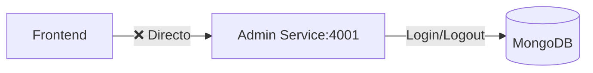
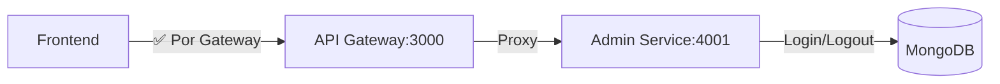

# Fase 1: Centralización de Login/Logout

**Fecha**: 2026-01-02
**Estado**: Lista para Implementación
**Duración Estimada**: 2-3 horas
**Riesgo**: BAJO
**Objetivo**: Centralizar login y logout del sistema de administración a través del API Gateway

---

## 📋 Resumen Ejecutivo

### Problema
Actualmente, el frontend hace login y logout directamente al Admin Service (puerto 4001), bypaseando completamente el API Gateway. Esto rompe la arquitectura de "único punto de entrada".

### Solución
Centralizar login/logout a través del API Gateway agregando la ruta faltante y actualizando las URLs del frontend.

### Beneficios
- ✅ Logging centralizado de autenticación
- ✅ Seguridad consistente (mismas políticas que otros endpoints)
- ✅ Arquitectura limpia con único punto de entrada
- ✅ Cookies httpOnly funcionan correctamente

---

## 🔍 Análisis Actual vs. Propuesto

### Estado Actual ❌


**Archivos con problemas:**
- `orders-producer-frontend/src/config/adminApi.ts:2` - `ADMIN_SERVICE_BASE = 'http://localhost:4001'`
- `orders-producer-frontend/src/config/adminApi.ts:5-6` - Login/Logout usan URL directa

### Estado Propuesto ✅


---

## 📝 Cambios Requeridos

### 1.1 API Gateway - Agregar Método Logout

**Archivo**: `api-gateway/src/controllers/AdminController.ts`

```typescript
// Agregar después del método login (línea ~51)
logout = async (req: Request, res: Response, next: NextFunction) => {
  try {
    const headers = this.getAuthHeaders(req);
    const r = await this.proxy.forward('/admin/auth/logout', 'POST', undefined, headers);
    res.status(HTTP_STATUS.OK).json(r.data);
  } catch (e) {
    console.error('❌ Logout error:', e);
    next(e);
  }
};
```

**Archivo**: `api-gateway/src/routes/admin.routes.ts`

```typescript
// Agregar después de la línea 11
router.post('/auth/login', controller.login);
router.post('/auth/logout', controller.logout);  // ✅ NUEVO
```

### 1.2 Frontend - Corregir URLs de Configuración

**Archivo**: `orders-producer-frontend/src/config/adminApi.ts`

```typescript
// ANTES (❌ INCORRECTO):
export const ADMIN_API_BASE = import.meta.env.VITE_API_GATEWAY_URL || 'http://localhost:3000';
export const ADMIN_SERVICE_BASE = 'http://localhost:4001'; // ❌ REMOVER ESTA LÍNEA

export const ADMIN_ENDPOINTS = {
  LOGIN: `${ADMIN_SERVICE_BASE}/admin/auth/login`,    // ❌ BYPASS directo
  LOGOUT: `${ADMIN_SERVICE_BASE}/admin/auth/logout`,  // ❌ BYPASS directo
  USERS: `${ADMIN_API_BASE}/api/admin/users`,         // ✅ Ya correcto
  PRODUCTS: `${ADMIN_API_BASE}/api/admin/products`,   // ✅ Ya correcto
  // ... otros endpoints ya están correctos
};

// DESPUÉS (✅ CORRECTO):
export const ADMIN_API_BASE = import.meta.env.VITE_API_GATEWAY_URL || 'http://localhost:3000';

export const ADMIN_ENDPOINTS = {
  LOGIN: `${ADMIN_API_BASE}/api/admin/auth/login`,    // ✅ Por Gateway
  LOGOUT: `${ADMIN_API_BASE}/api/admin/auth/logout`,  // ✅ Por Gateway
  USERS: `${ADMIN_API_BASE}/api/admin/users`,
  PRODUCTS: `${ADMIN_API_BASE}/api/admin/products`,
  // ... resto sin cambios
};
```

---

## 🧪 Testing Strategy - Postman Collection

### Configuración de Postman

#### 1. Crear Collection
```
📁 API Gateway Centralization
├── 📁 Environments
│   └── 🔧 local.postman_environment.json
└── 📁 Auth
    ├── 🔐 Login Admin
    └── 🔐 Logout Admin
```

#### 2. Environment Variables
```json
{
  "id": "local",
  "name": "Local Development",
  "values": [
    {
      "key": "base_url",
      "value": "http://localhost:3000",
      "description": "API Gateway base URL"
    },
    {
      "key": "auth_token",
      "value": "",
      "description": "JWT token for authenticated requests"
    }
  ]
}
```

#### 3. Request: Login Admin
```
Method: POST
URL: {{base_url}}/api/admin/auth/login
Headers:
  Content-Type: application/json

Body (raw JSON):
{
  "email": "admin@sofka.com.co",
  "password": "encrypted_password_from_adminService.ts"
}
```

**Pre-request Script:**
```javascript
// No se necesita pre-request para login
```

**Tests:**
```javascript
pm.test("Status code is 200", function () {
  pm.response.to.have.status(200);
});

pm.test("Response has success field", function () {
  const jsonData = pm.response.json();
  pm.expect(jsonData).to.have.property('success', true);
});

pm.test("Response has user data", function () {
  const jsonData = pm.response.json();
  pm.expect(jsonData).to.have.property('user');
});

pm.test("Cookies are set", function () {
  pm.expect(pm.cookies.has('accessToken')).to.be.true;
});

pm.test("Set auth_token environment variable", function () {
  const jsonData = pm.response.json();
  if (jsonData.token) {
    pm.environment.set("auth_token", jsonData.token);
  }
});
```

#### 4. Request: Logout Admin
```
Method: POST
URL: {{base_url}}/api/admin/auth/logout
Headers:
  Content-Type: application/json
  Cookie: accessToken={{auth_token}}  // Si no usa cookies automáticamente
```

**Pre-request Script:**
```javascript
// Asegurar que tenemos token
if (!pm.environment.get("auth_token")) {
  pm.sendRequest({
    url: pm.variables.get("base_url") + "/api/admin/auth/login",
    method: 'POST',
    header: {
      'Content-Type': 'application/json'
    },
    body: {
      mode: 'raw',
      raw: JSON.stringify({
        email: "admin@sofka.com.co",
        password: "encrypted_password"
      })
    }
  }, function (err, response) {
    if (!err && response.code === 200) {
      const token = response.json().token;
      pm.environment.set("auth_token", token);
    }
  });
}
```

**Tests:**
```javascript
pm.test("Status code is 200", function () {
  pm.response.to.have.status(200);
});

pm.test("Response has success field", function () {
  const jsonData = pm.response.json();
  pm.expect(jsonData).to.have.property('success', true);
});

pm.test("Cookie is cleared", function () {
  // Nota: El backend debería invalidar/clear la cookie
  pm.expect(pm.cookies.has('accessToken')).to.be.false;
});
```

---

## 🏃‍♂️ Pasos de Implementación

### Paso 1: Implementar Cambios en API Gateway
```bash
cd api-gateway

# 1. Agregar método logout en AdminController.ts
# 2. Agregar ruta logout en admin.routes.ts

# 3. Verificar sintaxis TypeScript
npm run build

# 4. Tests unitarios
npm test -- AdminController.test.ts
```

### Paso 2: Actualizar Frontend
```bash
cd orders-producer-frontend

# 1. Modificar adminApi.ts
# 2. Verificar que no se rompen imports

# 3. Build de frontend
npm run build
```

### Paso 3: Testing Manual
```bash
# 1. Levantar servicios
docker compose up -d --build

# 2. Verificar API Gateway logs
docker logs -f api-gateway

# 3. Abrir navegador http://localhost:5173
# 4. Login con admin@sofka.com.co / admin123
# 5. Verificar en DevTools Network que requests van a :3000
# 6. Logout y verificar cookie eliminada
```

### Paso 4: Testing con Postman
```bash
# Ejecutar collection completa
# 1. Importar collection y environment
# 2. Ejecutar "Login Admin" → debería pasar
# 3. Ejecutar "Logout Admin" → debería pasar
```

---

## 📋 Checklist de Aceptación

### ✅ Funcionalidad
- [ ] Login exitoso retorna `accessToken` en cookie httpOnly
- [ ] Login fallido retorna error apropiado (400/401)
- [ ] Logout invalida token correctamente
- [ ] Cookies tienen dominio correcto (`localhost:5173`)
- [ ] Admin dashboard sigue funcionando
- [ ] Password recovery no se rompe

### ✅ Arquitectura
- [ ] Login request va a `http://localhost:3000/api/admin/auth/login`
- [ ] Logout request va a `http://localhost:3000/api/admin/auth/logout`
- [ ] API Gateway registra login/logout en logs
- [ ] No hay llamadas directas al puerto 4001 desde frontend

### ✅ Testing
- [ ] Postman collection "Login Admin" pasa todos los tests
- [ ] Postman collection "Logout Admin" pasa todos los tests
- [ ] Tests de integración pasan (`npm test` en api-gateway)
- [ ] Tests de frontend no se rompen

---

## 🚨 Plan de Rollback

Si algo falla, rollback inmediato en **< 5 minutos**:

```bash
# 1. Revertir cambios en git
git checkout orders-producer-frontend/src/config/adminApi.ts
git checkout api-gateway/src/controllers/AdminController.ts
git checkout api-gateway/src/routes/admin.routes.ts

# 2. Rebuild servicios
docker compose down
docker compose up -d --build api-gateway front

# 3. Verificar servicios
docker ps
curl http://localhost:3000/api/admin/auth/login  # Debe responder

# 4. Confirmar rollback exitoso
# - Login funciona directo al :4001 (temporal)
# - Sistema vuelve a estado anterior
```

---

## 📊 Métricas de Éxito

| Métrica | Valor Esperado | Cómo Medir |
|---------|----------------|------------|
| **Login bypasses** | 0% | Network tab: todas las requests a :3000 |
| **Test coverage** | +2 tests | Postman collection |
| **Response time** | <100ms | Postman response time |
| **Success rate** | 100% | Postman test results |

---

## 📚 Referencias

### Archivos Modificados
- `api-gateway/src/controllers/AdminController.ts`
- `api-gateway/src/routes/admin.routes.ts`
- `orders-producer-frontend/src/config/adminApi.ts`

### Archivos de Testing
- Postman Collection: `API Gateway Centralization`
- Environment: `local.postman_environment.json`

### Documentación Relacionada
- [API_GATEWAY_CENTRALIZATION_ANALYSIS.md](../API_GATEWAY_CENTRALIZATION_ANALYSIS.md) - Plan completo
- [AGENTS.md](../../AGENTS.md) - Guía de desarrollo

---

## 📝 Log de Cambios

| Fecha | Autor | Cambio |
|-------|-------|--------|
| 2026-01-02 | AI Assistant | Fase 1 creada con detalles completos de implementación |

---

**Fin de Fase 1**