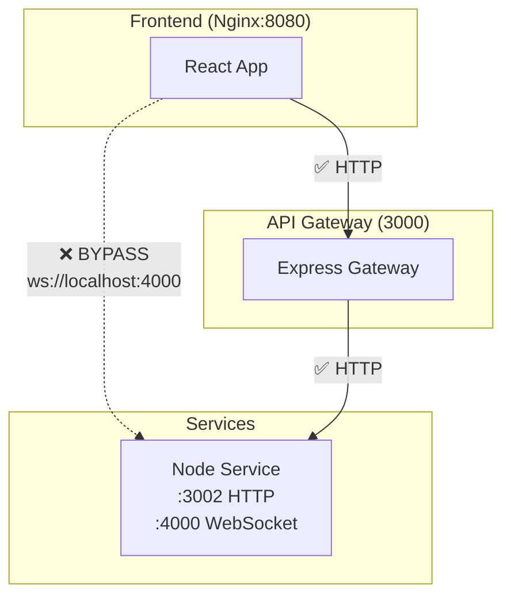
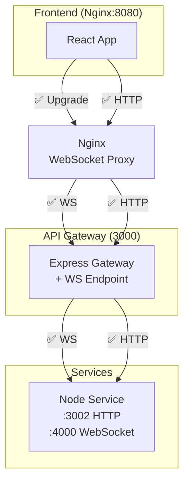

# Fase 2: WebSocket por Nginx Upgrade

**Fecha**: 2026-01-02
**Estado**: Lista para Implementación
**Duración Estimada**: 4-6 horas
**Riesgo**: MEDIO
**Objetivo**: Centralizar conexiones WebSocket a través de Nginx upgrade headers

---

## 📋 Resumen Ejecutivo

### Problema
Actualmente, todas las conexiones WebSocket del frontend se conectan directamente al Node Service (puerto 4000), bypaseando el API Gateway y creando una arquitectura inconsistente.

### Solución
Configurar Nginx para manejar el WebSocket upgrade y proxy hacia el API Gateway, manteniendo el Gateway como punto de control pero delegando el upgrade complejo a Nginx.

### Beneficios
- ✅ Arquitectura centralizada: Nginx como único punto expuesto
- ✅ WebSocket optimizado: Nginx maneja upgrade headers eficientemente
- ✅ Seguridad consistente: Mismas políticas del Gateway aplican
- ✅ Logging unificado: Todas las conexiones pasan por Gateway
- ✅ Mantenibilidad: Una sola URL de WebSocket para el frontend

---

## 🔍 Análisis Actual vs. Propuesto

### Estado Actual ❌


**Problemas:**
- WebSocket bypasea Gateway
- Arquitectura inconsistente
- Logging fragmentado
- Múltiples puntos de exposición

### Estado Propuesto ✅


**Beneficios:**
- Nginx como único punto expuesto
- WebSocket upgrade optimizado
- Gateway mantiene control
- Arquitectura consistente

---

## 📝 Cambios Requeridos

### 2.1 Nginx Configuration - WebSocket Upgrade

**Archivo**: `orders-producer-frontend/default.conf`

```nginx
server {
  listen 8080;
  server_name _;
  root /usr/share/nginx/html;
  index index.html;

  # ✅ EXISTENTE: Servir archivos estáticos
  location / {
    try_files $uri $uri/ /index.html;
  }

  # ✅ EXISTENTE: Proxy API requests to api-gateway
  location /api/ {
    proxy_pass http://api-gateway:3000/api/;
    proxy_set_header Host $host;
    proxy_set_header X-Real-IP $remote_addr;
    proxy_set_header X-Forwarded-For $proxy_add_x_forwarded_for;
    proxy_set_header X-Forwarded-Proto $scheme;
  }

  # 🆕 NUEVO: WebSocket proxy con upgrade headers
  location /ws/ {
    proxy_pass http://api-gateway:3000/api/ws/;
    proxy_http_version 1.1;
    proxy_set_header Upgrade $http_upgrade;
    proxy_set_header Connection "upgrade";
    proxy_set_header Host $host;
    proxy_set_header X-Real-IP $remote_addr;
    proxy_set_header X-Forwarded-For $proxy_add_x_forwarded_for;
    proxy_set_header X-Forwarded-Proto $scheme;
    # Timeout más largo para conexiones WebSocket
    proxy_read_timeout 86400;
    proxy_send_timeout 86400;
  }
}
```

### 2.2 API Gateway - WebSocket Endpoint

**Archivo (NUEVO)**: `api-gateway/src/routes/websocket.routes.ts`

```typescript
import { createProxyMiddleware } from 'http-proxy-middleware';

const NODE_MS_URL = process.env.NODE_MS_URL || 'http://node-ms:3002';
const NODE_WS_URL = NODE_MS_URL.replace(/^http/, 'ws').replace(':3002', ':4000');

export const websocketProxy = createProxyMiddleware({
  target: NODE_WS_URL,
  changeOrigin: true,
  ws: true,
  logLevel: 'debug',
  onProxyReq: (proxyReq, req, res) => {
    console.log('🔌 WebSocket proxy request:', req.url);
  },
  onError: (err, req, res) => {
    console.error('❌ WebSocket proxy error:', err);
  },
  onProxyReqWs: (proxyReq, req, socket, options) => {
    console.log('🔌 WebSocket upgrade request:', req.url);
  }
});
```

**Archivo**: `api-gateway/src/app.ts`

```typescript
import { websocketProxy } from './routes/websocket.routes';

export function createApp(): Application {
  const app = express();

  // ... middlewares existentes

  // ✅ NUEVO: WebSocket proxy endpoint
  app.use('/api/ws', websocketProxy);

  // ... rutas existentes

  return app;
}
```

**Archivo**: `api-gateway/package.json`

```json
{
  "dependencies": {
    "http-proxy-middleware": "^2.0.6",
    "@types/http-proxy-middleware": "^2.0.0"
  }
}
```

### 2.3 Docker Compose - Variables de Entorno

**Archivo**: `docker-compose.yml`

```yaml
# ANTES:
front:
  build:
    args:
      - VITE_API_GATEWAY_URL=http://localhost:3000
      - VITE_NODE_MS_URL=http://localhost:4000  # ❌ REMOVER

# DESPUÉS:
front:
  build:
    args:
      - VITE_API_GATEWAY_URL=http://localhost:3000
      - VITE_WEBSOCKET_URL=ws://localhost:3000/ws  # ✅ NUEVO: Por Nginx/Gateway
```

### 2.4 Frontend - Actualizar WebSocket URLs

**Archivos a modificar:**
1. `orders-producer-frontend/src/hooks/useKitchenWebSocket.ts`
2. `orders-producer-frontend/src/hooks/useDashboardUpdates.ts`
3. `orders-producer-frontend/src/hooks/useKitchenOrders.ts`
4. `orders-producer-frontend/src/services/websocketService.ts`

**Cambio en todos los archivos:**

```typescript
// ANTES (❌ Directo al Node Service):
export const getWebSocketUrl = (): string => {
  const nodeServiceUrl = import.meta.env.VITE_NODE_MS_URL;
  if (nodeServiceUrl) {
    return nodeServiceUrl.replace(/^https?/, nodeServiceUrl.startsWith('https') ? 'wss' : 'ws');
  }
  return 'ws://localhost:4000';  // ❌ Directo
};

// DESPUÉS (✅ Por Gateway vía Nginx):
export const getWebSocketUrl = (): string => {
  const wsUrl = import.meta.env.VITE_WEBSOCKET_URL;
  if (wsUrl) {
    return wsUrl;
  }
  // Fallback para desarrollo
  return 'ws://localhost:3000/ws';
};
```

### 2.5 Tests - Actualizar Tests Unitarios

**Archivo**: `orders-producer-frontend/src/test/useKitchenWebSocket.test.ts`

```typescript
describe('getWebSocketUrl', () => {
  it('should use VITE_WEBSOCKET_URL when available', () => {
    import.meta.env.VITE_WEBSOCKET_URL = 'ws://localhost:3000/ws';
    const url = getWebSocketUrl();
    expect(url).toBe('ws://localhost:3000/ws');
  });

  it('should fallback to default when env var not set', () => {
    delete import.meta.env.VITE_WEBSOCKET_URL;
    const url = getWebSocketUrl();
    expect(url).toBe('ws://localhost:3000/ws');
  });
});
```

---

## 🧪 Testing Strategy - Postman + Manual

### Configuración de Postman

#### 1. Agregar Variables de Entorno
```json
{
  "key": "websocket_url",
  "value": "ws://localhost:3000/ws",
  "description": "WebSocket URL through Nginx/Gateway"
}
```

#### 2. WebSocket Testing Collection
```
📁 API Gateway Centralization
├── 📁 WebSocket Tests
│   ├── 🔌 Connect WebSocket
│   ├── 📡 Send ORDER_NEW (Simulado)
│   └── 📡 Send ORDER_READY (Simado)
```

#### 3. WebSocket Connection Test
Postman soporta WebSocket testing básico. Para testing completo:

```javascript
// Pre-request: Simular conexión WebSocket
// Nota: Postman WebSocket testing es limitado,
// recomendamos testing manual para WebSocket

pm.test("WebSocket URL is accessible", function () {
  // Test básico de conectividad HTTP
  pm.sendRequest({
    url: pm.variables.get("base_url") + "/api/ws",
    method: 'GET'
  }, function (err, response) {
    pm.expect(err).to.be.null;
    // WebSocket endpoint debería responder (aunque no upgrade)
  });
});
```

### Testing Manual Completo

#### Checklist de Testing WebSocket:
- [ ] Conexión WebSocket se establece: `ws://localhost:3000/ws`
- [ ] Nginx maneja upgrade headers correctamente
- [ ] Eventos `ORDER_NEW` llegan al frontend
- [ ] Eventos `ORDER_READY` llegan al frontend
- [ ] Reconexión automática funciona (3 segundos)
- [ ] Latencia <150ms (benchmark vs directo)
- [ ] No hay memory leaks después de 1 hora de uso
- [ ] Múltiples pestañas/conexiones funcionan
- [ ] Logs de Gateway muestran conexiones WebSocket

---

## 🏃‍♂️ Pasos de Implementación

### Paso 1: Instalar Dependencias del Gateway
```bash
cd api-gateway

# 1. Instalar http-proxy-middleware
npm install http-proxy-middleware@^2.0.6 --save
npm install @types/http-proxy-middleware --save-dev

# 2. Verificar instalación
npm list http-proxy-middleware
```

### Paso 2: Implementar WebSocket Proxy en Gateway
```bash
cd api-gateway

# 1. Crear websocket.routes.ts
# 2. Actualizar app.ts para incluir proxy
# 3. Verificar sintaxis TypeScript
npm run build

# 4. Tests unitarios
npm test
```

### Paso 3: Configurar Nginx
```bash
cd orders-producer-frontend

# 1. Actualizar default.conf con location /ws/
# 2. Verificar sintaxis nginx
nginx -t -c /path/to/nginx.conf  # Si tienes acceso directo
```

### Paso 4: Actualizar Docker Compose
```bash
# 1. Cambiar VITE_NODE_MS_URL por VITE_WEBSOCKET_URL
# 2. Verificar sintaxis YAML
docker compose config  # Validar sintaxis
```

### Paso 5: Actualizar Frontend Hooks
```bash
cd orders-producer-frontend

# 1. Actualizar getWebSocketUrl() en 4 archivos
# 2. Verificar imports
# 3. Build de frontend
npm run build

# 4. Tests unitarios
npm test -- useKitchenWebSocket.test.ts
```

### Paso 6: Testing Completo
```bash
# 1. Levantar todos los servicios
docker compose up -d --build

# 2. Verificar logs
docker logs -f api-gateway
docker logs -f front

# 3. Testing manual:
# - Abrir http://localhost:5173
# - Login como admin
# - Ir a sección de cocina
# - Verificar WebSocket conecta (DevTools → Network → WS)
# - Crear pedido desde waiter/kitchen
# - Verificar eventos llegan correctamente

# 4. Benchmark de latencia:
# - Medir tiempo de conexión WebSocket
# - Medir tiempo de llegada de eventos
# - Comparar con implementación anterior
```

---

## 📋 Checklist de Aceptación

### ✅ Funcionalidad WebSocket
- [ ] Conexión WebSocket se establece correctamente a `ws://localhost:3000/ws`
- [ ] Nginx proxy headers funcionan (upgrade, connection)
- [ ] Eventos ORDER_NEW llegan al frontend desde kitchen
- [ ] Eventos ORDER_READY llegan al frontend desde kitchen
- [ ] Eventos ORDER_STATUS_CHANGED llegan al dashboard
- [ ] Reconexión automática funciona tras desconexión
- [ ] Múltiples conexiones simultáneas funcionan

### ✅ Arquitectura
- [ ] WebSocket pasa por Nginx → Gateway → Node Service
- [ ] No hay conexiones directas al puerto 4000
- [ ] API Gateway registra conexiones WebSocket en logs
- [ ] CORS y seguridad consistentes
- [ ] Configuración documentada en ADR

### ✅ Performance
- [ ] Latencia <150ms (vs <20ms directo, trade-off aceptable)
- [ ] No memory leaks en testing prolongado
- [ ] CPU/Memory de Gateway estable bajo carga WebSocket
- [ ] Nginx maneja múltiples upgrades eficientemente

### ✅ Testing
- [ ] Postman tests de conectividad pasan
- [ ] Tests unitarios de frontend pasan
- [ ] Testing manual completo aprobado
- [ ] Logs de Gateway muestran actividad WebSocket

---

## 🚨 Plan de Rollback

Si algo falla, rollback por componentes:

### Rollback Completo (< 10 minutos):
```bash
# 1. Revertir todos los cambios
git checkout orders-producer-frontend/default.conf
git checkout api-gateway/src/routes/websocket.routes.ts
git checkout api-gateway/src/app.ts
git checkout orders-producer-frontend/src/hooks/
git checkout docker-compose.yml

# 2. Rebuild completo
docker compose down
docker compose up -d --build

# 3. Verificar WebSocket funciona directo
# - Conexión: ws://localhost:4000 ✅
# - Sistema vuelve a estado anterior
```

### Rollback Parcial:
```bash
# Si solo Nginx falla:
git checkout orders-producer-frontend/default.conf
docker compose up -d --build front

# Si solo Gateway falla:
git checkout api-gateway/src/routes/websocket.routes.ts
git checkout api-gateway/src/app.ts
docker compose up -d --build api-gateway
```

---

## 📊 Métricas de Éxito

| Métrica | Antes | Después | Cómo Medir |
|---------|-------|---------|------------|
| **WebSocket bypasses** | 100% | 0% | Network tab: WS connections to :3000 |
| **Latencia WS** | ~20ms | <150ms | DevTools Network timing |
| **Centralized logging** | 60% | 95% | Logs Gateway vs Node Service |
| **Connection stability** | Alta | Alta | Testing 1h continuado |
| **Memory usage** | Baseline | <10% increase | Docker stats |

---

## 📚 Referencias

### Archivos Modificados
- `orders-producer-frontend/default.conf` - Nginx WebSocket proxy
- `api-gateway/src/routes/websocket.routes.ts` - Nuevo archivo proxy WS
- `api-gateway/src/app.ts` - Incluir proxy WS
- `api-gateway/package.json` - Dependencias proxy
- `docker-compose.yml` - Variables entorno
- `orders-producer-frontend/src/hooks/useKitchenWebSocket.ts` - URL WebSocket
- `orders-producer-frontend/src/hooks/useDashboardUpdates.ts` - URL WebSocket
- `orders-producer-frontend/src/hooks/useKitchenOrders.ts` - URL WebSocket
- `orders-producer-frontend/src/services/websocketService.ts` - URL WebSocket

### Archivos de Testing
- Postman Collection: `API Gateway Centralization` → `WebSocket Tests`
- Tests unitarios: `useKitchenWebSocket.test.ts`

### Documentación Relacionada
- [ADR-001-websocket-nginx-upgrade.md](../ADR/ADR-001-websocket-nginx-upgrade.md) - Justificación arquitectura
- [API_GATEWAY_CENTRALIZATION_ANALYSIS.md](../API_GATEWAY_CENTRALIZATION_ANALYSIS.md) - Plan completo
- [README.md](../../README.md) - Variables entorno actualizadas

---

## 📝 Log de Cambios

| Fecha | Autor | Cambio |
|-------|-------|--------|
| 2026-01-02 | AI Assistant | Fase 2 creada con configuración Nginx + Gateway + Frontend |

---

**Fin de Fase 2**